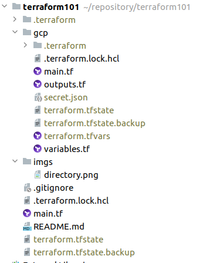

# Terraform 101

```bash
terraform init          # create resource terraform provider
terraform fmt           # code format
terraform validate      # validate terraform format
terraform apply         # recheck current infra state and update or create
terraform show          # show current resource state
terraform destroy       # terminate all provision
```

## Some hidden file

